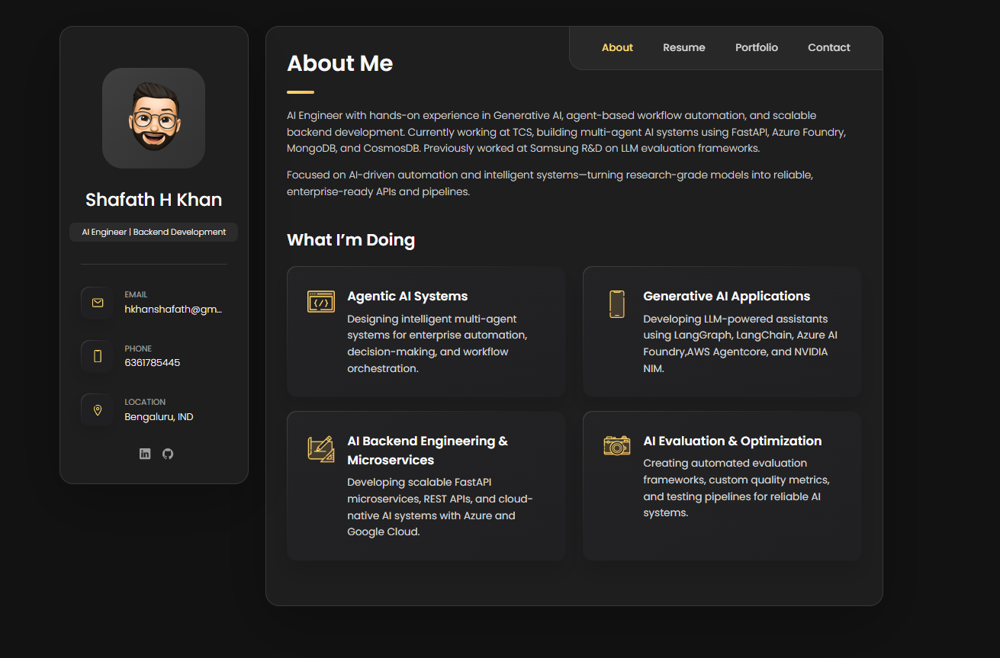

# 🌐 Personal Portfolio

A modern, responsive personal portfolio showcasing my experience, skills, and AI projects. Built with HTML, CSS, and JavaScript, the portfolio highlights my work in Generative AI, Agentic AI, backend development, and cloud-native applications.
<p align="center">
<a href="https://your-portfolio-url.com">
    
</a>
</p>

## 📖 About

I'm **Shafath H Khan**, an AI Engineer passionate about building intelligent applications using Large Language Models, Agentic AI, and scalable backend systems.

This portfolio showcases my professional experience, technical skills, and featured AI projects, including enterprise automation systems, conversational AI assistants, and machine learning applications.

---

## ✨ Features

- Responsive modern UI
- Dark-themed professional design
- Resume & experience timeline
- Interactive project showcase
- Contact form
- Social media integration
- Mobile-friendly layout
- Fast loading static website

---

## 🛠 Tech Stack

- HTML5
- CSS3
- JavaScript
- Ionicons
- Google Fonts

---

## 📂 Featured Projects

### 🤖 Agentic AI Ticket Analysis & SOP Generation
Enterprise AI automation platform that analyzes IT support tickets, generates SOPs, maps AI agents, and identifies transformation opportunities using multi-agent workflows.

**Tech:** Azure AI Foundry, FastAPI, OpenAI, MongoDB, Cosmos DB

---

### ✈️ Travel Bhai – Intelligent AI Travel Assistant
An AI-powered conversational travel assistant capable of planning personalized trips using LangGraph and NVIDIA NIM. The assistant searches flights, recommends attractions, performs currency conversion, and estimates travel budgets.

**Tech:** LangGraph, LangChain, NVIDIA NIM, Streamlit, Google Cloud Run

---

### 🧠 Quality Assurance Framework for Text Generation Models
Automated framework for evaluating LLM-generated responses using custom quality metrics and structured testing pipelines.

**Tech:** Python, Gemini API, Prompt Engineering

---

### 📦 Product Classification Model
Machine learning pipeline for classifying products into categories and subcategories using NLP techniques.

**Tech:** Python, Scikit-learn, TF-IDF

---

### 👤 Face Recognition Attendance System
AI-powered attendance system using computer vision and facial recognition.

**Tech:** Python, OpenCV

---

## 📁 Project Structure

```
portfolio/
│
├── assets/
│   ├── css/
│   ├── js/
│   ├── images/
│   └── icons/
│
├── index.html
├── README.md
└── LICENSE
```

---

## ⚙️ Running Locally

Clone the repository

```bash
git clone https://github.com/shafathhkhan/portfolio.git
```

Navigate to the project

```bash
cd portfolio
```

Open `index.html` in your browser.

Or use VS Code Live Server.

---

## 📬 Contact

**Shafath H Khan**

📧 hkhanshafath@gmail.com

🔗 LinkedIn  
https://www.linkedin.com/in/shafath-h-khan-60916b25a

💻 GitHub  
https://github.com/shafathhkhan

---

## ⭐ Support

If you like this portfolio or found it useful, consider giving the repository a ⭐ on GitHub.

---

© 2026 Shafath H Khan. All rights reserved.